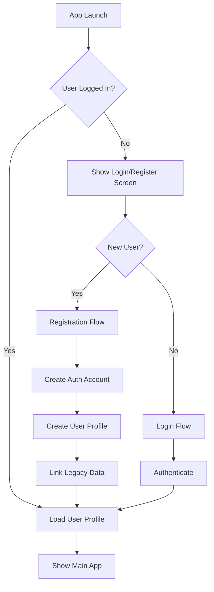
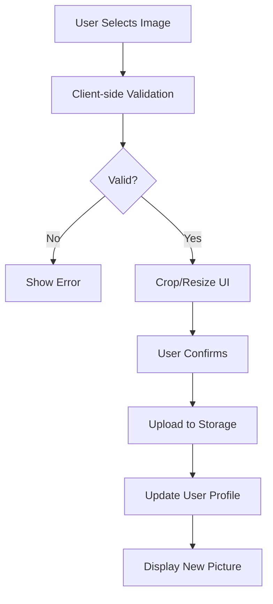
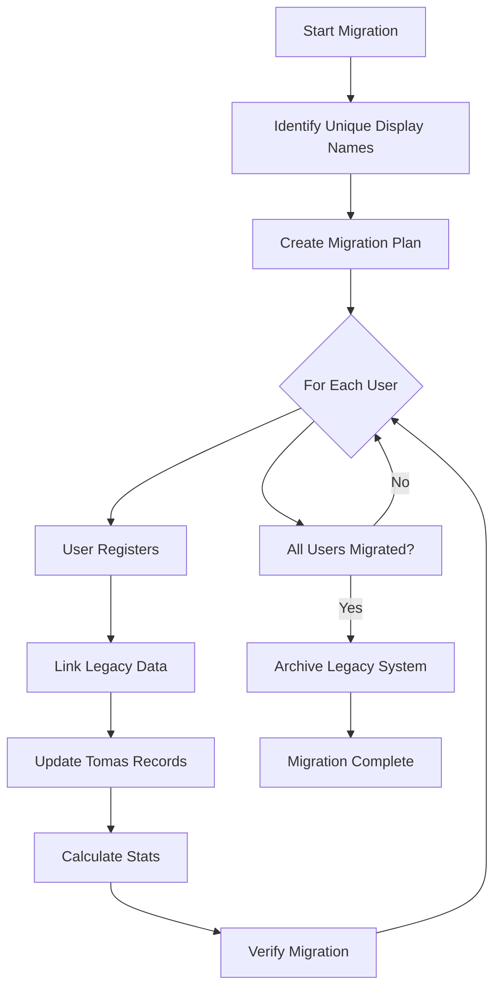
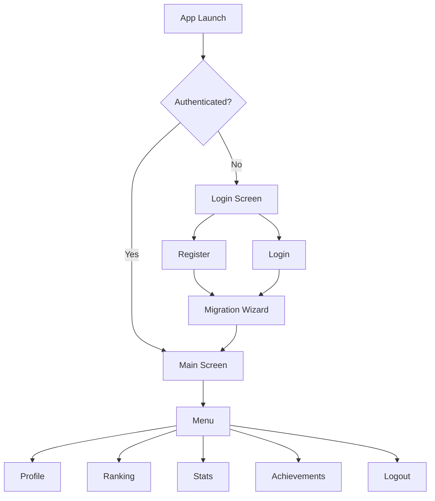
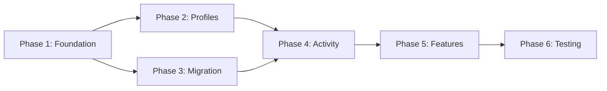

# Candelita User Profile System - Technical Architecture Design

## Executive Summary

This document outlines the comprehensive technical architecture for transforming Candelita from a shared-password system to a full-featured user profile system with individual authentication, customizable profiles, activity tracking, and statistics.

**Current State:**
- Single SHA-256 password shared by all users
- Display names stored in localStorage
- Firebase Firestore `tomas` collection: `{usuario: string, fecha: Timestamp}`
- No unique user IDs or individual authentication
- Activity tracking via string matching on display names

**Target State:**
- Firebase Authentication with email/password
- Individual user profiles with pictures and settings
- Personal activity history and statistics
- Preserved historical data with backward compatibility

---

## Table of Contents

1. [Firebase Authentication Integration](#1-firebase-authentication-integration)
2. [Firestore Data Model](#2-firestore-data-model)
3. [Profile Picture System](#3-profile-picture-system)
4. [Activity History & Statistics](#4-activity-history--statistics)
5. [Data Migration Strategy](#5-data-migration-strategy)
6. [UI/UX Changes](#6-uiux-changes)
7. [Implementation Phases](#7-implementation-phases)
8. [Security Considerations](#8-security-considerations)
9. [Risk Assessment](#9-risk-assessment)

---

## 1. Firebase Authentication Integration

### 1.1 Authentication Flow



### 1.2 Authentication Methods

**Primary Method: Email/Password**
- Simple, no external dependencies
- Works offline after initial login (Firebase persistence)
- Familiar to users

**Implementation:**
```javascript
import { 
  getAuth, 
  createUserWithEmailAndPassword,
  signInWithEmailAndPassword,
  signOut,
  sendPasswordResetEmail,
  onAuthStateChanged,
  setPersistence,
  browserLocalPersistence
} from "https://www.gstatic.com/firebasejs/10.8.0/firebase-auth.js";

const auth = getAuth(app);

// Set persistence to LOCAL (survives browser restarts)
await setPersistence(auth, browserLocalPersistence);
```

### 1.3 Registration Flow

**Steps:**
1. User enters email, password, and display name
2. Validate inputs (email format, password strength ≥8 chars)
3. Create Firebase Auth account
4. Create user profile document in Firestore
5. Optionally link to legacy data by display name
6. Redirect to profile setup (picture upload)

**Code Structure:**
```javascript
async function registerUser(email, password, displayName) {
  try {
    // Create auth account
    const userCredential = await createUserWithEmailAndPassword(auth, email, password);
    const user = userCredential.user;
    
    // Create user profile
    await setDoc(doc(db, 'users', user.uid), {
      uid: user.uid,
      email: email,
      displayName: displayName,
      displayNameLower: displayName.toLowerCase(),
      photoURL: null,
      createdAt: serverTimestamp(),
      settings: {
        notifications: true,
        publicProfile: true,
        theme: 'auto'
      },
      stats: {
        totalCount: 0,
        currentStreak: 0,
        longestStreak: 0,
        lastActivity: null
      }
    });
    
    return user;
  } catch (error) {
    throw error;
  }
}
```

### 1.4 Session Management

**Strategy: Firebase Auth State Persistence**
```javascript
// Listen for auth state changes
onAuthStateChanged(auth, async (user) => {
  if (user) {
    // User is signed in
    await loadUserProfile(user.uid);
    initializeApp(user);
  } else {
    // User is signed out
    showLoginScreen();
  }
});
```

### 1.5 Security Considerations

**Password Requirements:**
- Minimum 8 characters
- Recommended: Mix of letters, numbers, symbols
- Firebase enforces basic security

**Rate Limiting:**
- Firebase automatically rate-limits authentication attempts
- Prevents brute force attacks

**Token Management:**
- Firebase handles token refresh automatically
- Tokens expire after 1 hour, refreshed silently

---

## 2. Firestore Data Model

### 2.1 Collections Overview

```
firestore/
├── users/              # User profiles
│   └── {userId}/
├── tomas/              # Activity records
│   └── {tomaId}/
└── config/             # App configuration
    └── app/
```

### 2.2 Users Collection

**Document ID:** Firebase Auth UID

**Structure:**
```javascript
{
  // Identity
  uid: "firebase_auth_uid",
  email: "user@example.com",
  displayName: "Elena & Tomás",
  displayNameLower: "elena & tomás",
  
  // Profile
  photoURL: "https://storage.googleapis.com/...",
  photoStoragePath: "profile-pictures/{uid}/avatar.jpg",
  bio: "Couple description",
  
  // Settings
  settings: {
    notifications: true,
    publicProfile: true,
    theme: "auto",
    language: "es"
  },
  
  // Statistics (cached)
  stats: {
    totalCount: 42,
    currentStreak: 5,
    longestStreak: 15,
    lastActivity: Timestamp,
    thisMonthCount: 8,
    thisYearCount: 42
  },
  
  // Achievements
  achievements: ["first_time", "5_days_streak", "10_total"],
  
  // Metadata
  createdAt: Timestamp,
  updatedAt: Timestamp,
  lastLoginAt: Timestamp,
  
  // Migration support
  legacyDisplayName: "Elena & Tomás",
  migrationDate: Timestamp
}
```

**Indexes Required:**
```javascript
users: [
  { fields: ["displayNameLower", "createdAt"], order: "ASC" },
  { fields: ["stats.totalCount", "createdAt"], order: "DESC" },
  { fields: ["stats.thisMonthCount", "createdAt"], order: "DESC" }
]
```

### 2.3 Tomas Collection (Updated)

**Document ID:** Auto-generated by Firestore

**Structure:**
```javascript
{
  // User identification (BOTH for compatibility)
  userId: "firebase_auth_uid",  // NEW: unique user ID
  userName: "Elena & Tomás",    // KEPT: for backward compatibility
  
  // Activity data
  fecha: Timestamp,
  
  // Optional metadata
  manual: false,
  note: "",
  
  // Metadata
  createdAt: Timestamp,
  
  // Migration support
  migratedFrom: "legacy",
  migrationDate: Timestamp
}
```

**Why Keep userName?**
1. **Backward Compatibility:** Existing queries work during transition
2. **Display Performance:** No need to join with users collection
3. **Historical Accuracy:** Preserves name at time of activity
4. **Migration Safety:** Allows gradual transition

**Indexes Required:**
```javascript
tomas: [
  { fields: ["userId", "fecha"], order: "DESC" },
  { fields: ["userName", "fecha"], order: "DESC" },
  { fields: ["fecha"], order: "DESC" }
]
```

### 2.4 Security Rules

```javascript
rules_version = '2';
service cloud.firestore {
  match /databases/{database}/documents {
    
    function isAuthenticated() {
      return request.auth != null;
    }
    
    function isOwner(userId) {
      return isAuthenticated() && request.auth.uid == userId;
    }
    
    // Users collection
    match /users/{userId} {
      allow read: if isAuthenticated() && 
                     (resource.data.settings.publicProfile == true || 
                      isOwner(userId));
      
      allow create: if isOwner(userId) && 
                       request.resource.data.uid == userId;
      
      allow update: if isOwner(userId);
      allow delete: if false;
    }
    
    // Tomas collection
    match /tomas/{tomaId} {
      allow read: if isAuthenticated();
      
      allow create: if isAuthenticated() && 
                       request.resource.data.userId == request.auth.uid;
      
      allow update: if isAuthenticated() && 
                       resource.data.userId == request.auth.uid;
      
      allow delete: if isAuthenticated() && 
                       resource.data.userId == request.auth.uid;
    }
    
    // Config collection
    match /config/{document} {
      allow read: if isAuthenticated();
      allow write: if false;
    }
  }
}
```

---

## 3. Profile Picture System

### 3.1 Storage Solution: Firebase Storage

**Structure:**
```
gs://candelita-pura.firebasestorage.app/
└── profile-pictures/
    └── {userId}/
        ├── avatar.jpg
        ├── avatar_thumb.jpg
        └── previous/
            └── avatar_20260521.jpg
```

### 3.2 Upload Workflow



### 3.3 Implementation

```javascript
import { 
  getStorage, 
  ref, 
  uploadBytes, 
  getDownloadURL
} from "https://www.gstatic.com/firebasejs/10.8.0/firebase-storage.js";

const storage = getStorage(app);

async function uploadProfilePicture(userId, file) {
  // Validate
  if (!file.type.startsWith('image/')) {
    throw new Error('File must be an image');
  }
  if (file.size > 5 * 1024 * 1024) {
    throw new Error('Image must be less than 5MB');
  }
  
  // Create storage reference
  const storageRef = ref(storage, `profile-pictures/${userId}/avatar.jpg`);
  
  // Upload
  const snapshot = await uploadBytes(storageRef, file);
  
  // Get download URL
  const downloadURL = await getDownloadURL(snapshot.ref);
  
  // Update user profile
  await updateDoc(doc(db, 'users', userId), {
    photoURL: downloadURL,
    photoStoragePath: `profile-pictures/${userId}/avatar.jpg`,
    updatedAt: serverTimestamp()
  });
  
  return downloadURL;
}
```

### 3.4 Default Avatar Generation

```javascript
function generateDefaultAvatar(displayName) {
  const initials = displayName
    .split(' ')
    .map(word => word[0])
    .join('')
    .toUpperCase()
    .slice(0, 2);
  
  const colors = ['#FF6B6B', '#4ECDC4', '#45B7D1', '#FFA07A'];
  const colorIndex = displayName.length % colors.length;
  const bgColor = colors[colorIndex];
  
  const svg = `
    <svg width="150" height="150" xmlns="http://www.w3.org/2000/svg">
      <rect width="150" height="150" fill="${bgColor}"/>
      <text x="50%" y="50%" 
            font-family="Arial" 
            font-size="60" 
            font-weight="bold" 
            fill="white" 
            text-anchor="middle" 
            dominant-baseline="central">
        ${initials}
      </text>
    </svg>
  `;
  
  return `data:image/svg+xml;base64,${btoa(svg)}`;
}
```

### 3.5 Storage Security Rules

```javascript
rules_version = '2';
service firebase.storage {
  match /b/{bucket}/o {
    match /profile-pictures/{userId}/{fileName} {
      allow read: if true;
      
      allow write: if request.auth != null && 
                      request.auth.uid == userId &&
                      request.resource.size < 5 * 1024 * 1024 &&
                      request.resource.contentType.matches('image/.*');
      
      allow delete: if request.auth != null && 
                       request.auth.uid == userId;
    }
  }
}
```

---

## 4. Activity History & Statistics

### 4.1 Statistics to Track

**Personal Statistics:**
```javascript
{
  // Totals
  totalCount: 42,
  thisMonthCount: 8,
  thisYearCount: 42,
  
  // Streaks
  currentStreak: 5,
  longestStreak: 15,
  lastActivity: Timestamp,
  
  // Patterns
  favoriteHour: 23,
  favoriteDay: 6,
  averagePerMonth: 7.5,
  
  // Achievements
  achievementsUnlocked: 12,
  lastAchievement: "night_owl",
  lastAchievementDate: Timestamp
}
```

### 4.2 Storage Strategy

**Hybrid Approach: Cached + Calculated**

**Cached in User Profile (Fast Access):**
- Total counts (all-time, month, year)
- Current/longest streaks
- Last activity date
- Achievements unlocked

**Calculated On-Demand (Detailed Analysis):**
- Hour/day distributions
- Monthly history charts
- Detailed streak history
- Comparative rankings

**Rationale:**
- Cached stats provide instant UI updates
- Calculated stats ensure accuracy and flexibility
- Balance between performance and storage costs

### 4.3 Statistics Update Strategy

**Client-side Implementation:**

```javascript
async function updateStatsAfterToma(userId) {
  const userRef = doc(db, 'users', userId);
  const userSnap = await getDoc(userRef);
  
  if (!userSnap.exists()) return;
  
  // Fetch user's tomas
  const tomasQuery = query(
    collection(db, 'tomas'),
    where('userId', '==', userId),
    orderBy('fecha', 'desc')
  );
  const tomasSnap = await getDocs(tomasQuery);
  
  // Calculate stats
  const stats = calculateStatsFromTomas(tomasSnap.docs);
  
  // Update user profile
  await updateDoc(userRef, {
    stats: stats,
    updatedAt: serverTimestamp()
  });
}

function calculateStatsFromTomas(tomaDocs) {
  const now = new Date();
  const currentMonth = now.getMonth();
  const currentYear = now.getFullYear();
  
  let totalCount = 0;
  let thisMonthCount = 0;
  let thisYearCount = 0;
  let currentStreak = 0;
  let longestStreak = 0;
  
  const uniqueDays = new Set();
  
  tomaDocs.forEach(doc => {
    const data = doc.data();
    const tomaDate = data.fecha.toDate();
    
    totalCount++;
    
    if (tomaDate.getMonth() === currentMonth && 
        tomaDate.getFullYear() === currentYear) {
      thisMonthCount++;
    }
    
    if (tomaDate.getFullYear() === currentYear) {
      thisYearCount++;
    }
    
    uniqueDays.add(tomaDate.toDateString());
  });
  
  // Calculate streaks
  const sortedDays = Array.from(uniqueDays).sort((a, b) => 
    new Date(b) - new Date(a)
  );
  
  let tempStreak = 0;
  let lastDate = null;
  
  for (const dayStr of sortedDays) {
    const day = new Date(dayStr);
    
    if (!lastDate) {
      tempStreak = 1;
      lastDate = day;
    } else {
      const diffDays = Math.floor((lastDate - day) / (1000 * 60 * 60 * 24));
      
      if (diffDays === 1) {
        tempStreak++;
      } else {
        if (currentStreak === 0) currentStreak = tempStreak;
        tempStreak = 1;
      }
      
      lastDate = day;
    }
    
    longestStreak = Math.max(longestStreak, tempStreak);
  }
  
  if (currentStreak === 0) currentStreak = tempStreak;
  
  return {
    totalCount,
    thisMonthCount,
    thisYearCount,
    currentStreak,
    longestStreak,
    lastActivity: tomaDocs[0]?.data().fecha || null
  };
}
```

### 4.4 Detailed Analytics Queries

**Monthly History:**
```javascript
async function getMonthlyHistory(userId, months = 12) {
  const tomasQuery = query(
    collection(db, 'tomas'),
    where('userId', '==', userId),
    orderBy('fecha', 'desc')
  );
  
  const snapshot = await getDocs(tomasQuery);
  const monthlyData = {};
  
  snapshot.forEach(doc => {
    const fecha = doc.data().fecha.toDate();
    const monthKey = `${fecha.getFullYear()}-${String(fecha.getMonth() + 1).padStart(2, '0')}`;
    monthlyData[monthKey] = (monthlyData[monthKey] || 0) + 1;
  });
  
  return Object.entries(monthlyData)
    .sort((a, b) => b[0].localeCompare(a[0]))
    .slice(0, months)
    .map(([month, count]) => ({ month, count }));
}
```

**Hour Distribution:**
```javascript
async function getHourDistribution(userId) {
  const tomasQuery = query(
    collection(db, 'tomas'),
    where('userId', '==', userId)
  );
  
  const snapshot = await getDocs(tomasQuery);
  const hourCounts = Array(24).fill(0);
  
  snapshot.forEach(doc => {
    const fecha = doc.data().fecha.toDate();
    hourCounts[fecha.getHours()]++;
  });
  
  return hourCounts;
}
```

### 4.5 Achievements System

**Achievement Definitions:**
```javascript
const ACHIEVEMENTS = {
  first_time: {
    id: 'first_time',
    name: 'Primera vez',
    description: 'Registra tu primer delicioso',
    icon: '🎉',
    check: (stats) => stats.totalCount >= 1
  },
  
  streak_5: {
    id: 'streak_5',
    name: '5 días consecutivos',
    description: 'Mantén una racha de 5 días',
    icon: '🔥',
    check: (stats) => stats.currentStreak >= 5
  },
  
  streak_10: {
    id: 'streak_10',
    name: '10 días consecutivos',
    icon: '🔥🔥',
    check: (stats) => stats.currentStreak >= 10
  },
  
  total_10: {
    id: 'total_10',
    name: '10 históricos',
    icon: '🎯',
    check: (stats) => stats.totalCount >= 10
  },
  
  total_50: {
    id: 'total_50',
    name: '50 históricos',
    icon: '🎯',
    check: (stats) => stats.totalCount >= 50
  },
  
  total_100: {
    id: 'total_100',
    name: '100 históricos',
    icon: '💯',
    check: (stats) => stats.totalCount >= 100
  },
  
  month_10: {
    id: 'month_10',
    name: '10 en un mes',
    icon: '📅',
    check: (stats) => stats.thisMonthCount >= 10
  },
  
  night_owl: {
    id: 'night_owl',
    name: 'Búho nocturno',
    description: 'Delicioso entre 2am y 4am',
    icon: '🌙',
    checkToma: (toma) => {
      const hour = toma.fecha.toDate().getHours();
      return hour >= 2 && hour < 4;
    }
  },
  
  early_bird: {
    id: 'early_bird',
    name: 'Madrugador',
    description: 'Delicioso entre 5am y 8am',
    icon: '☀️',
    checkToma: (toma) => {
      const hour = toma.fecha.toDate().getHours();
      return hour >= 5 && hour < 8;
    }
  }
};
```

**Achievement Checking:**
```javascript
async function checkAndUnlockAchievements(userId, stats) {
  const userRef = doc(db, 'users', userId);
  const userSnap = await getDoc(userRef);
  const currentAchievements = userSnap.data()?.achievements || [];
  
  const newAchievements = [];
  
  for (const [id, achievement] of Object.entries(ACHIEVEMENTS)) {
    if (!currentAchievements.includes(id) && achievement.check && achievement.check(stats)) {
      newAchievements.push(id);
    }
  }
  
  if (newAchievements.length > 0) {
    await updateDoc(userRef, {
      achievements: [...currentAchievements, ...newAchievements],
      lastAchievement: newAchievements[newAchievements.length - 1],
      lastAchievementDate: serverTimestamp()
    });
    
    showAchievementNotification(newAchievements);
  }
}
```

---

## 5. Data Migration Strategy

### 5.1 Migration Overview



### 5.2 Pre-Migration Analysis

**Step 1: Identify Unique Users**
```javascript
async function analyzeExistingUsers() {
  const tomasQuery = query(collection(db, 'tomas'));
  const snapshot = await getDocs(tomasQuery);
  
  const userStats = {};
  
  snapshot.forEach(doc => {
    const userName = doc.data().usuario;
    if (!userStats[userName]) {
      userStats[userName] = {
        name: userName,
        count: 0,
        firstActivity: null,
        lastActivity: null
      };
    }
    
    const fecha = doc.data().fecha.toDate();
    userStats[userName].count++;
    
    if (!userStats[userName].firstActivity || fecha < userStats[userName].firstActivity) {
      userStats[userName].firstActivity = fecha;
    }
    if (!userStats[userName].lastActivity || fecha > userStats[userName].lastActivity) {
      userStats[userName].lastActivity = fecha;
    }
  });
  
  return Object.values(userStats);
}
```

### 5.3 Migration Phases

**Phase 1: Preparation (No User Impact)**
1. Deploy new code with dual-mode support
2. Add `userId` field to tomas collection (optional, null allowed)
3. Update security rules to allow both old and new formats
4. Create migration tracking in config/app

**Phase 2: User Registration (Gradual)**
1. Show migration banner to existing users
2. Users register with email/password
3. System prompts to link legacy data by display name
4. Automatic linking if display name matches

**Phase 3: Data Linking**
```javascript
async function linkLegacyData(userId, legacyDisplayName) {
  try {
    // Find all tomas with matching display name
    const tomasQuery = query(
      collection(db, 'tomas'),
      where('userName', '==', legacyDisplayName),
      where('userId', '==', null)
    );
    
    const snapshot = await getDocs(tomasQuery);
    const batch = writeBatch(db);
    
    let linkedCount = 0;
    snapshot.forEach(doc => {
      batch.update(doc.ref, {
        userId: userId,
        migratedFrom: 'legacy',
        migrationDate: serverTimestamp()
      });
      linkedCount++;
    });
    
    await batch.commit();
    
    // Update user profile
    await updateDoc(doc(db, 'users', userId), {
      legacyDisplayName: legacyDisplayName,
      migrationDate: serverTimestamp()
    });
    
    // Calculate stats
    await updateStatsAfterMigration(userId);
    
    return { success: true, linkedCount };
  } catch (error) {
    console.error('Migration error:', error);
    return { success: false, error };
  }
}
```

### 5.4 Handling Edge Cases

**Case 1: Multiple Users with Same Display Name**
```javascript
async function handleDuplicateNames(displayName) {
  const tomasQuery = query(
    collection(db, 'tomas'),
    where('userName', '==', displayName),
    orderBy('fecha', 'desc')
  );
  
  const snapshot = await getDocs(tomasQuery);
  
  // Show list for user to select which ones are theirs
  return snapshot.docs.map(doc => ({
    id: doc.id,
    fecha: doc.data().fecha.toDate(),
    selected: false
  }));
}
```

**Case 2: User Wants Different Display Name**
```javascript
async function updateDisplayNameDuringMigration(userId, newDisplayName, legacyName) {
  await updateDoc(doc(db, 'users', userId), {
    displayName: newDisplayName,
    displayNameLower: newDisplayName.toLowerCase(),
    legacyDisplayName: legacyName
  });
  
  // Update all linked tomas
  const tomasQuery = query(
    collection(db, 'tomas'),
    where('userId', '==', userId)
  );
  
  const snapshot = await getDocs(tomasQuery);
  const batch = writeBatch(db);
  
  snapshot.forEach(doc => {
    batch.update(doc.ref, { userName: newDisplayName });
  });
  
  await batch.commit();
}
```

### 5.5 Backward Compatibility

**During Migration Period:**
- Both `userName` and `userId` queries work
- Old clients can still use `userName` only
- New clients prefer `userId` but fall back to `userName`

**Query Strategy:**
```javascript
async function getUserTomas(userIdOrName) {
  // Try userId first
  let q = query(
    collection(db, 'tomas'),
    where('userId', '==', userIdOrName),
    orderBy('fecha', 'desc')
  );
  
  let snapshot = await getDocs(q);
  
  // Fallback to userName
  if (snapshot.empty) {
    q = query(
      collection(db, 'tomas'),
      where('userName', '==', userIdOrName),
      orderBy('fecha', 'desc')
    );
    snapshot = await getDocs(q);
  }
  
  return snapshot;
}
```

### 5.6 Rollback Plan

**If Migration Fails:**
1. Keep legacy `accessHash` system active
2. Don't delete any data
3. `userId` field remains optional
4. Users can continue with old system

**Rollback Steps:**
```javascript
async function rollbackMigration() {
  await updateDoc(doc(db, 'config', 'app'), {
    'migration.status': 'rolled_back',
    'features.newAuth': false
  });
  
  console.log('Migration rolled back. Legacy system active.');
}
```

---

## 6. UI/UX Changes

### 6.1 New Screens

**1. Login Screen**
- Email input field
- Password input field
- "Iniciar Sesión" button
- "¿No tienes cuenta? Regístrate" link
- "¿Olvidaste tu contraseña?" link

**2. Registration Screen**
- Email input field
- Password input field (with strength indicator)
- Confirm password field
- Display name input field
- "Registrarse" button
- "¿Ya tienes cuenta? Inicia sesión" link

**3. Profile Settings Screen**
- Profile picture with "Cambiar Foto" button
- Display name (editable)
- Email (read-only)
- Settings toggles:
  - Notifications
  - Public profile
  - Theme selection
- "Guardar Cambios" button
- "Cambiar Contraseña" button
- "Cerrar Sesión" button

**4. Activity History Screen**
- Personal statistics summary
- Monthly progress chart
- Time patterns (favorite hour/day)
- Recent activities list
- Filter options (month, year, all-time)

**5. Migration Wizard**
- Welcome message
- Legacy data detection
- Link confirmation
- Manual selection option
- Progress indicator

### 6.2 Updates to Existing Screens

**Main Screen ([`index.html`](index.html)):**
- Add profile picture in header/menu
- Update greeting to use authenticated user
- Keep existing functionality intact

**Ranking Screen:**
- Show profile pictures next to names
- Make names clickable to view profiles
- Add filter: "Solo mis amigos" vs "Global"

**Calendar:**
- Keep existing functionality
- Add user filter option
- Show profile picture in header

**Achievements Screen:**
- Keep existing layout
- Update to use user-specific achievements
- Add progress indicators

**Menu:**
- Add "Mi Perfil" menu item
- Update "Cerrar Sesión" to use Firebase Auth
- Add profile picture at top

### 6.3 Navigation Flow



### 6.4 Responsive Design Considerations

**Mobile-First Approach:**
- Touch-friendly buttons (min 44px)
- Optimized image sizes
- Simplified navigation
- Bottom navigation bar option

**Desktop Enhancements:**
- Sidebar navigation
- Larger profile pictures
- Multi-column layouts
- Hover effects

---

## 7. Implementation Phases

### Phase 1: Foundation (Week 1-2)

**Goal:** Set up authentication infrastructure

**Tasks:**
1. Add Firebase Authentication to project
2. Create login/registration screens
3. Implement auth state management
4. Update security rules for dual-mode
5. Test authentication flow

**Deliverables:**
- Working login/registration
- Session persistence
- Password reset functionality

**Estimated Complexity:** Medium

### Phase 2: User Profiles (Week 3-4)

**Goal:** Implement user profile system

**Tasks:**
1. Create users collection structure
2. Build profile settings screen
3. Implement profile picture upload
4. Create default avatar generator
5. Update menu to show profile

**Deliverables:**
- Complete user profiles
- Profile picture system
- Settings management

**Estimated Complexity:** Medium-High

### Phase 3: Data Migration (Week 5-6)

**Goal:** Migrate existing data safely

**Tasks:**
1. Build migration wizard UI
2. Implement legacy data linking
3. Create verification tools
4. Handle edge cases
5. Test rollback procedures

**Deliverables:**
- Migration wizard
- Data linking system
- Verification reports

**Estimated Complexity:** High

### Phase 4: Activity Tracking (Week 7-8)

**Goal:** Update activity system for new model

**Tasks:**
1. Update tomas collection structure
2. Implement statistics calculation
3. Build activity history screen
4. Create analytics queries
5. Update existing screens

**Deliverables:**
- Updated activity tracking
- Personal statistics
- History visualization

**Estimated Complexity:** Medium

### Phase 5: Features & Polish (Week 9-10)

**Goal:** Add enhancements and polish

**Tasks:**
1. Implement achievements system
2. Add profile viewing
3. Create friend system (optional)
4. Performance optimization
5. Bug fixes and testing

**Deliverables:**
- Achievements system
- Polished UI/UX
- Performance improvements

**Estimated Complexity:** Medium

### Phase 6: Testing & Launch (Week 11-12)

**Goal:** Comprehensive testing and deployment

**Tasks:**
1. End-to-end testing
2. User acceptance testing
3. Performance testing
4. Security audit
5. Gradual rollout

**Deliverables:**
- Tested system
- Documentation
- Launch plan

**Estimated Complexity:** Medium

### Dependencies Between Phases



---

## 8. Security Considerations

### 8.1 Authentication Security

**Password Security:**
- Minimum 8 characters enforced
- Firebase handles hashing (bcrypt)
- Rate limiting on login attempts
- Account lockout after failed attempts

**Session Security:**
- Secure token storage
- Automatic token refresh
- HTTPS only in production
- XSS protection via Content Security Policy

**Email Verification:**
- Optional but recommended
- Prevents fake accounts
- Improves account recovery

### 8.2 Data Security

**Firestore Security Rules:**
- Users can only read/write their own data
- Public profiles opt-in only
- Activity data readable by authenticated users
- No direct deletion allowed

**Storage Security Rules:**
- Profile pictures publicly readable
- Only owner can upload/delete
- File size limits enforced
- Content type validation

**API Key Security:**
- Firebase API keys are safe for client-side use
- Domain restrictions in Firebase Console
- Rate limiting enabled
- Monitoring for abuse

### 8.3 Privacy Considerations

**User Data:**
- Email addresses not publicly visible
- Display names can be pseudonymous
- Profile pictures optional
- Activity data private by default

**GDPR Compliance:**
- Users can download their data
- Users can delete their account
- Clear privacy policy
- Consent for data processing

**Data Retention:**
- Deleted accounts: soft delete (30 days)
- Activity data: retained indefinitely
- Profile pictures: deleted with account
- Logs: 90 days retention

### 8.4 Input Validation

**Client-side Validation:**
- Email format validation
- Password strength checking
- Display name length limits
- Image file type/size validation

**Server-side Validation:**
- Security rules enforce constraints
- Cloud Functions validate data (if used)
- Sanitize user inputs
- Prevent injection attacks

---

## 9. Risk Assessment

### 9.1 Technical Risks

**Risk: Data Loss During Migration**
- **Probability:** Low
- **Impact:** Critical
- **Mitigation:**
  - Backup all data before migration
  - Test migration on copy of production data
  - Implement verification checks
  - Keep legacy system as fallback
  - Gradual rollout with monitoring

**Risk: Authentication System Failure**
- **Probability:** Low
- **Impact:** High
- **Mitigation:**
  - Use proven Firebase Auth
  - Implement comprehensive error handling
  - Keep legacy auth as backup during transition
  - Monitor auth success rates
  - Have rollback plan ready

**Risk: Performance Degradation**
- **Probability:** Medium
- **Impact:** Medium
- **Mitigation:**
  - Implement proper indexing
  - Cache frequently accessed data
  - Use pagination for large datasets
  - Monitor query performance
  - Optimize images and assets

**Risk: Storage Costs Increase**
- **Probability:** Medium
- **Impact:** Low
- **Mitigation:**
  - Implement image compression
  - Set file size limits
  - Monitor storage usage
  - Clean up old profile pictures
  - Use Firebase free tier efficiently

### 9.2 User Experience Risks

**Risk: User Confusion During Migration**
- **Probability:** Medium
- **Impact:** Medium
- **Mitigation:**
  - Clear migration instructions
  - Step-by-step wizard
  - Help documentation
  - Support contact available
  - Gradual rollout with feedback

**Risk: Users Lose Access to Historical Data**
- **Probability:** Low
- **Impact:** High
- **Mitigation:**
  - Automatic data linking by display name
  - Manual selection for conflicts
  - Verification before finalizing
  - Support for recovery
  - Keep legacy data intact

**Risk: Adoption Resistance**
- **Probability:** Medium
- **Impact:** Medium
- **Mitigation:**
  - Communicate benefits clearly
  - Make migration easy
  - Provide incentives (achievements)
  - Gradual feature rollout
  - Gather and act on feedback

### 9.3 Security Risks

**Risk: Account Takeover**
- **Probability:** Low
- **Impact:** High
- **Mitigation:**
  - Strong password requirements
  - Email verification
  - Rate limiting on auth attempts
  - Monitor suspicious activity
  - Password reset functionality

**Risk: Data Breach**
- **Probability:** Very Low
- **Impact:** Critical
- **Mitigation:**
  - Use Firebase security features
  - Implement proper security rules
  - Regular security audits
  - HTTPS only
  - Monitor access logs

**Risk: Privacy Violations**
- **Probability:** Low
- **Impact:** High
- **Mitigation:**
  - Clear privacy settings
  - Opt-in for public profiles
  - GDPR compliance
  - Data export/deletion options
  - Privacy policy

### 9.4 Operational Risks

**Risk: Incomplete Migration**
- **Probability:** Medium
- **Impact:** Medium
- **Mitigation:**
  - Track migration progress
  - Send reminders to users
  - Set migration deadline
  - Provide support
  - Keep legacy system longer if needed

**Risk: Support Burden Increase**
- **Probability:** High
- **Impact:** Low
- **Mitigation:**
  - Comprehensive documentation
  - FAQ section
  - Clear error messages
  - Self-service tools
  - Monitor common issues

---

## 10. Success Metrics

### 10.1 Migration Success

- **Target:** 90% of active users migrated within 3 months
- **Measure:** Track user registrations and data linking
- **Success Criteria:**
  - All historical data preserved
  - No data loss incidents
  - User satisfaction >80%

### 10.2 System Performance

- **Target:** Page load time <2 seconds
- **Measure:** Monitor with Firebase Performance
- **Success Criteria:**
  - Auth flow <1 second
  - Profile load <1.5 seconds
  - Image upload <3 seconds

### 10.3 User Engagement

- **Target:** Maintain or increase activity levels
- **Measure:** Track daily/weekly active users
- **Success Criteria:**
  - No drop in activity registration
  - Increased profile customization
  - Achievement engagement >50%

---

## 11. Conclusion

This technical architecture provides a comprehensive roadmap for implementing a user profile system in Candelita. The design prioritizes:

1. **User Experience:** Smooth migration with minimal disruption
2. **Data Integrity:** Safe migration with verification and rollback
3. **Security:** Proper authentication and authorization
4. **Performance:** Efficient data structures and caching
5. **Scalability:** Room for future enhancements

### Key Architectural Decisions

1. **Firebase Authentication:** Proven, secure, easy to implement
2. **Hybrid Data Model:** Keep userName for compatibility, add userId for future
3. **Cached Statistics:** Balance between performance and accuracy
4. **Gradual Migration:** Minimize risk with phased approach
5. **Client-side Processing:** Reduce costs, improve responsiveness

### Next Steps

1. Review and approve this architecture
2. Set up development environment
3. Begin Phase 1: Foundation
4. Regular progress reviews
5. Adjust plan based on learnings

### Critical Considerations

- **Backup everything** before starting migration
- **Test thoroughly** on copy of production data
- **Communicate clearly** with users throughout
- **Monitor closely** during rollout
- **Be ready to rollback** if issues arise

---

## Appendix A: Code Examples

See inline code examples throughout this document for:
- Authentication flows
- Data model structures
- Security rules
- Migration scripts
- Statistics calculations
- UI components

## Appendix B: Firebase Configuration

**Required Firebase Services:**
- Authentication (Email/Password)
- Firestore Database
- Cloud Storage
- (Optional) Cloud Functions for automation

**Estimated Costs (Free Tier):**
- Authentication: 50,000 MAU free
- Firestore: 50,000 reads/day free
- Storage: 5GB free
- Bandwidth: 1GB/day free

**Expected Usage (10 active users):**
- Well within free tier limits
- Minimal ongoing costs
- Scale as needed

---

**Document Version:** 1.0  
**Last Updated:** 2026-05-21  
**Author:** Technical Architecture Team  
**Status:** Ready for Review